# The Ring
The Ring is a social app where you can create movie contests and vote for a winner.  
I use TMDB API for all the movie searching part, and to gather movie data.  
[If you want to hear more about it, check their website.](https://www.themoviedb.org/)
  
I also use [KingFisher](https://cocoapods.org/pods/Kingfisher) to fetch images easily, and [Firebase Realtime Database](https://firebase.google.com/docs/database/?&gclid=Cj0KCQjwwIPrBRCJARIsAFlVT88SAdKVKlt_Zz9t_KjsDVEWg0WZB66iEXLIhJrGDcMi2yhUM5RJN4YaArfzEALw_wcB) to store The Ring data.  
  
 

# Example

You wonder what is the best movie of 2019 ? Why don't you ask !  
With The Ring, you can create a contest for it.  
  
Let's say you have a few movies in your head, but don't know which is the best. You can list them and create rounds, where people will vote.  
  
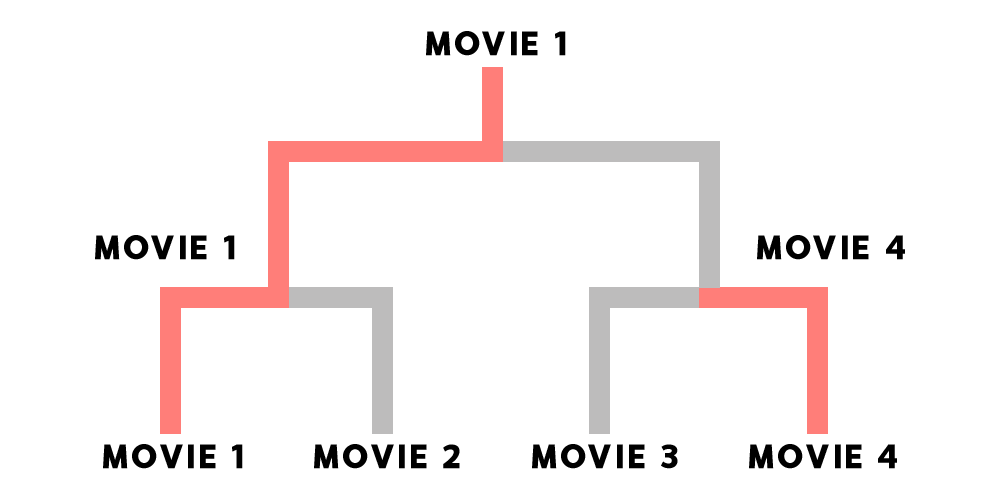
  
Here, 4 movies were listed. Movie 1 and 4 were the winners of the first round, and Movie 1 won the second round. It seems like we know which movie is the best !  
  
  
# Basic functionalities
  
- [x] Create an account
- [x] Login
- [x] User profile (with possibility to update data)
- [x] Friends system
- [x] Create a tournament
- [x] Consult tournaments
- [x] Share them
- [x] Vote
- [x] Comments on tournaments
- [x] Support of french language
- [x] Tournament search by titles
- [x] Home feed with user tournaments
  
# Login & Signup

To access The Ring, you need to create an account, and log in the app.  
When logged in, you have access to three tabs.
 - Home
 - User
 - Tournaments
  
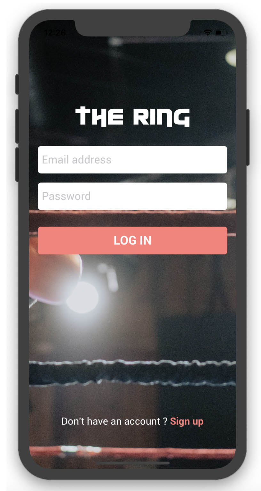   
  
  
# Home
  
  The home tab will show you all the tournaments that you created. You can click on them to see the tournament details, the comments and the results.
  
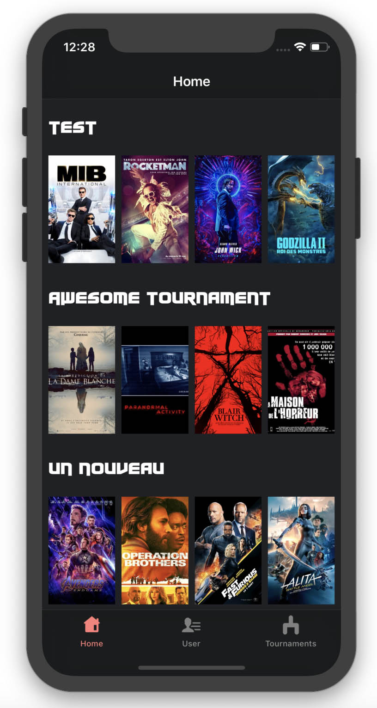  
  
  
# User
  
  In the user tab, you have access to your profile. You can update your personnal data here, change your password and email, and access to the friends functionnalities. 

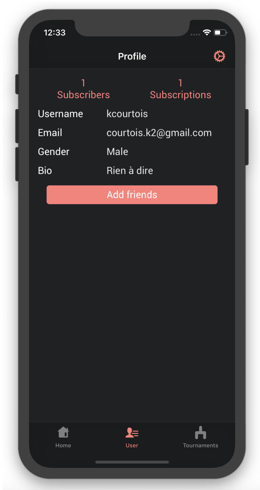 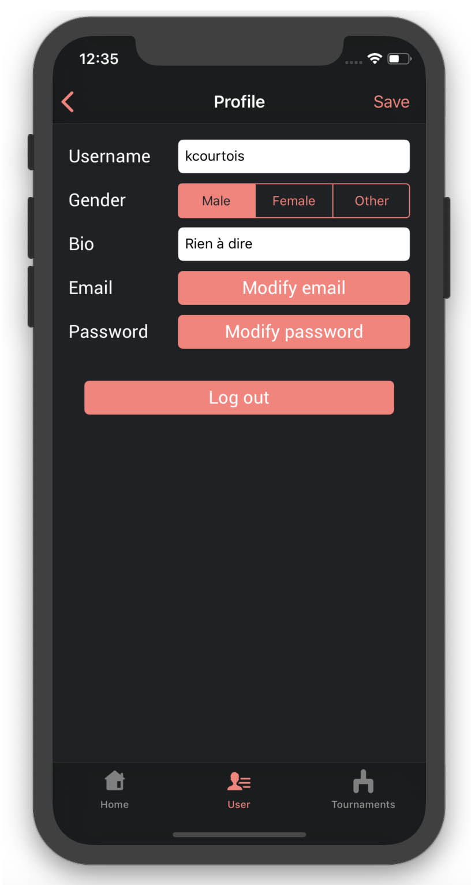  
 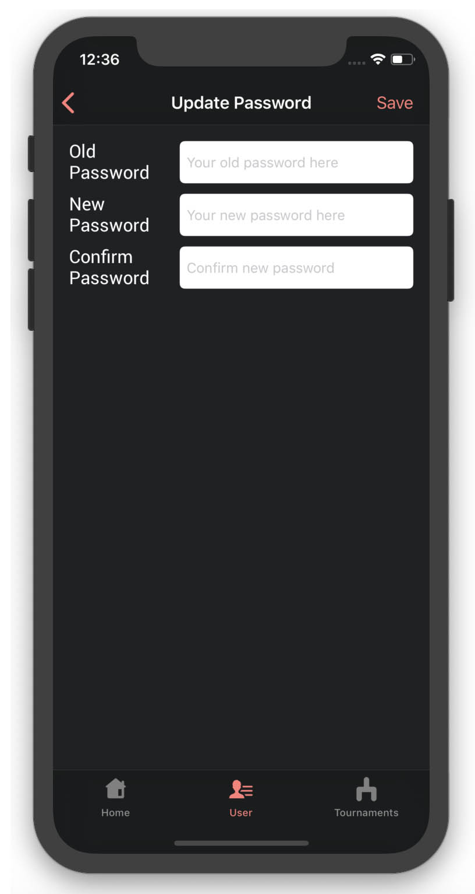  
  
  
# Friends
  
  When you click on "Add Friends", you can see your own friend code. This code can be scanned by an other user of the app with the "Scan code" button. You will then access user's profile, and subscribe to it.

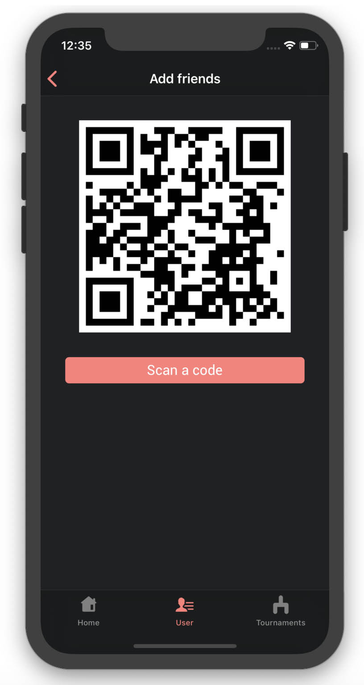 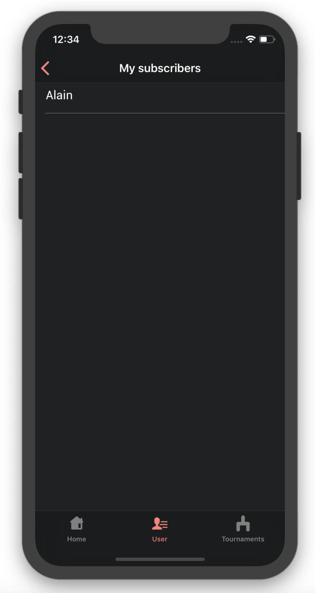 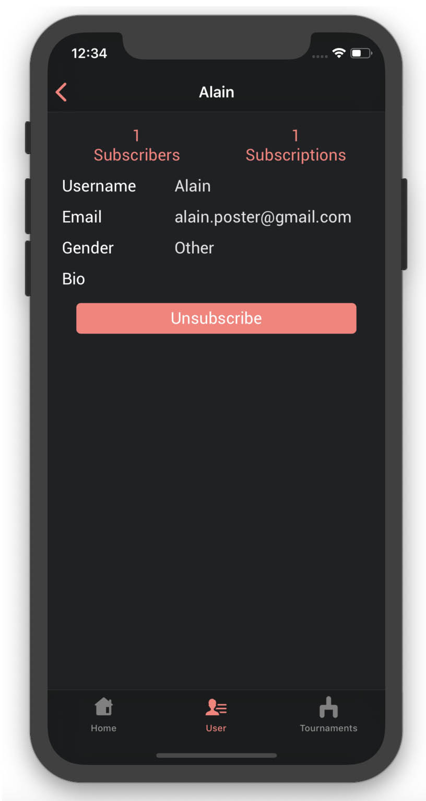  
  
# Tournament search & detailed view
  
  In the tournament tab, the first view you see is can see is a tournament search. It will show you all the tournaments created by the community, and you can do a research on tournament titles. Just like in your home tab, you can clic on a tournament to see its full details, and interact with it.

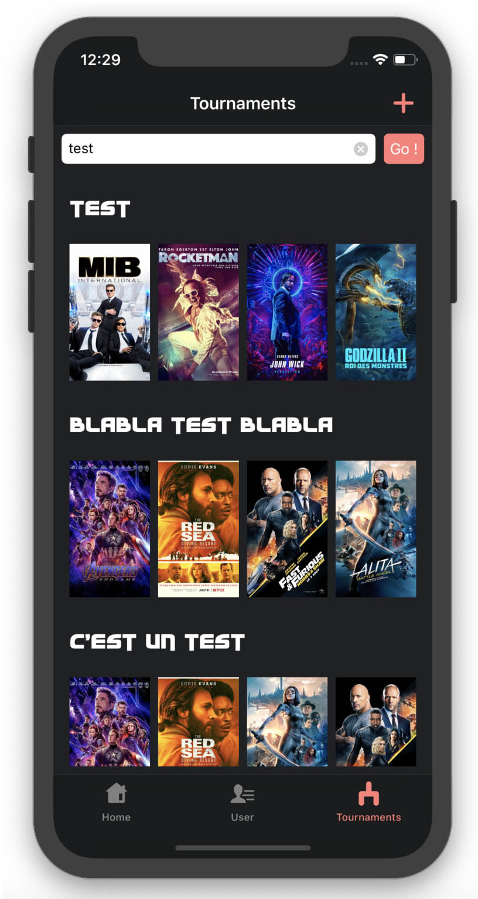 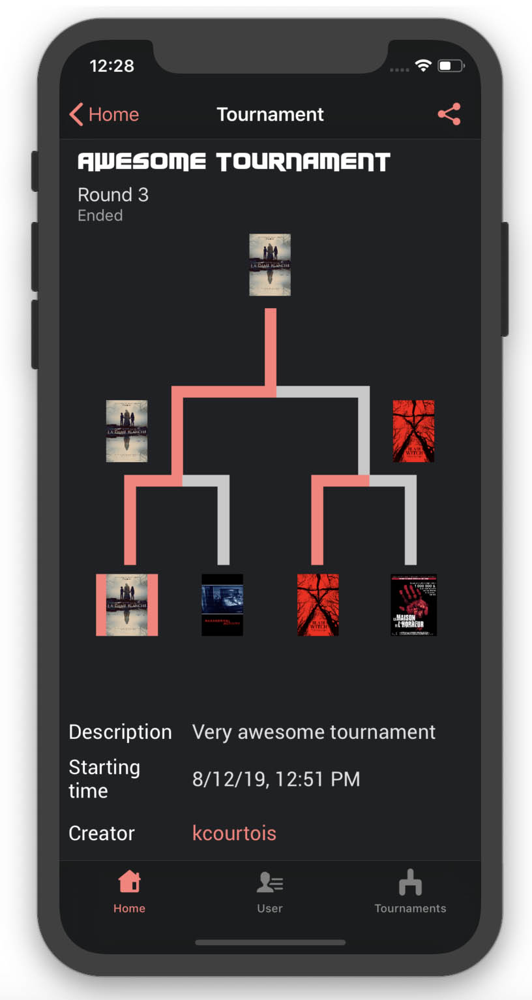 

# Comment tournaments

  In the tournament view, there is a comment feature. You can use it to interact with the fellowship of The Ring.

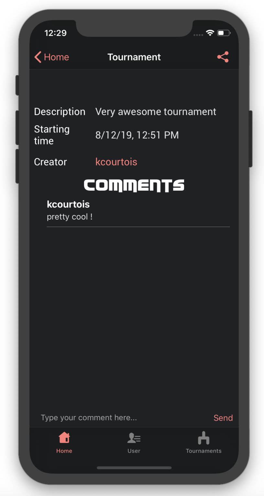
  
  
# Tournament creation
  
  When clicking on the "plus" in the tournament tab, you can create your own tournament. The first step is to fill title and description field for your tournament. Then, you'll need to pick four movies to fight each others. This will be done with the help of The Movie Database. You can either see what movies are trending right now and pick in that list, or search a specific movie. The final step will be to choose a duration for each round of the tournament, and a starting date, which will allow you to delay the end of the tournament. Users will still be able to vote for the first round, though.
  
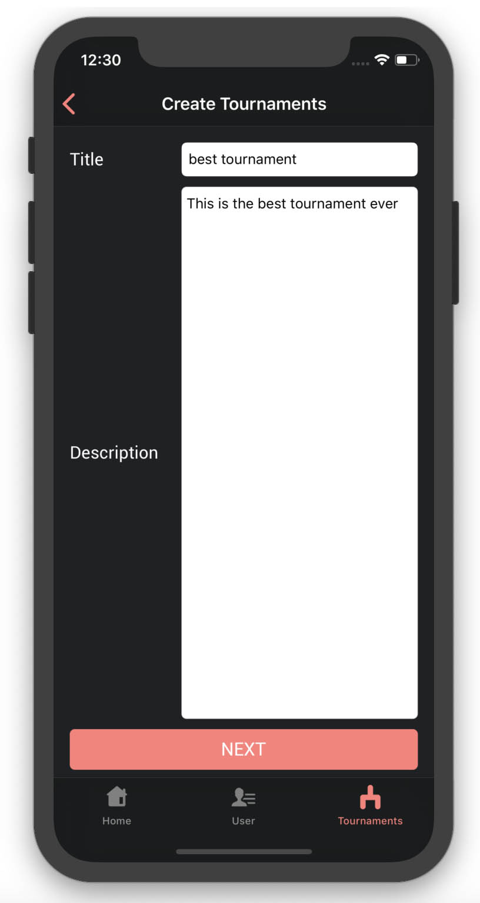 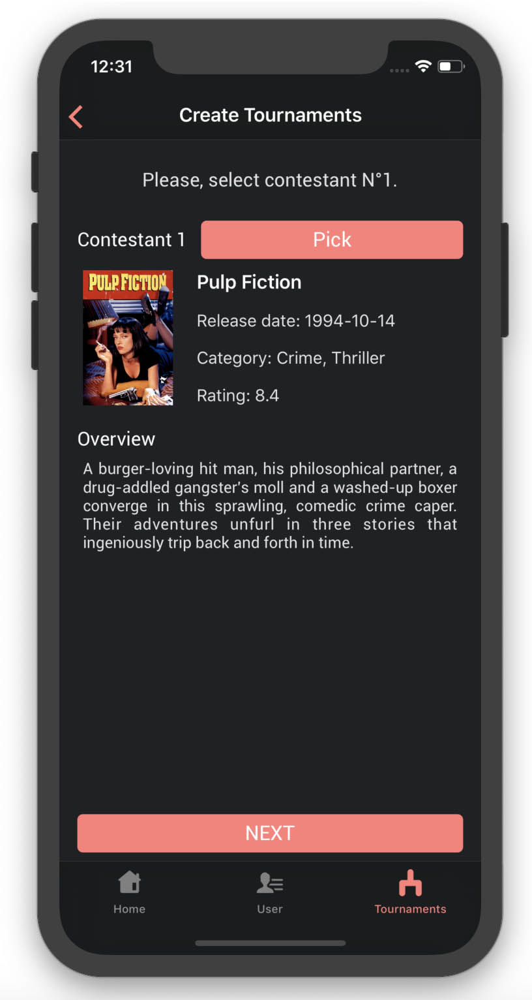  
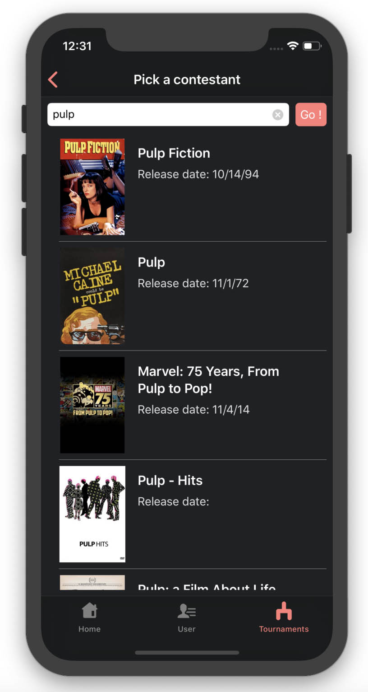 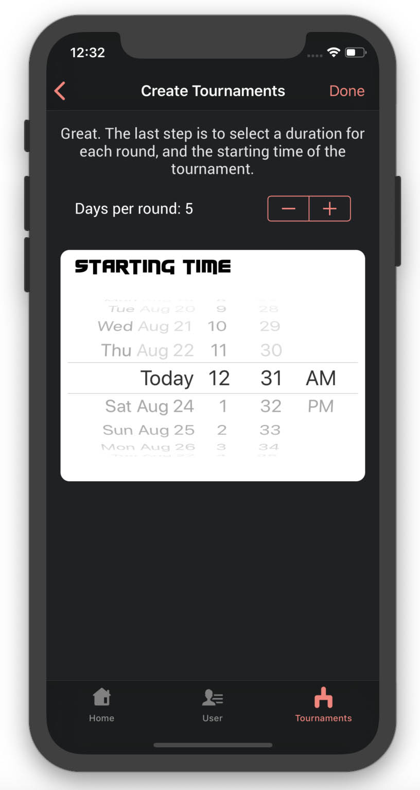  