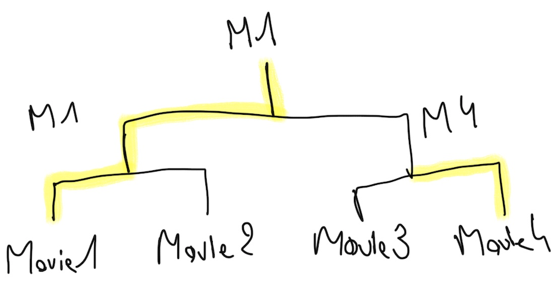

# The Ring
The Ring is a social app where you can create contests and vote for a winner.

 

# Example

You wonder what is the best movie of 2019 ? Why don't you ask !
With The Ring, you can create a contest for it.

Let's say you have a few movies in your head, but don't know which is the best. You can list them and create rounds, where people will vote.

Here, 4 movies were listed. Movie 1 and 4 were the winners of the first round, and Movie 1 won the second round. It seems like we know which movie is the best !

# Basic functionalities

- [x] Create an account
- [x] Login
- [x] User profile (with possibility to update data)
- [ ] Friends system
- [x] Create a tournament
- [ ] Consult tournaments
- [ ] Share them
- [ ] Vote
- [ ] Comments on tournaments
- [x] Support of french language