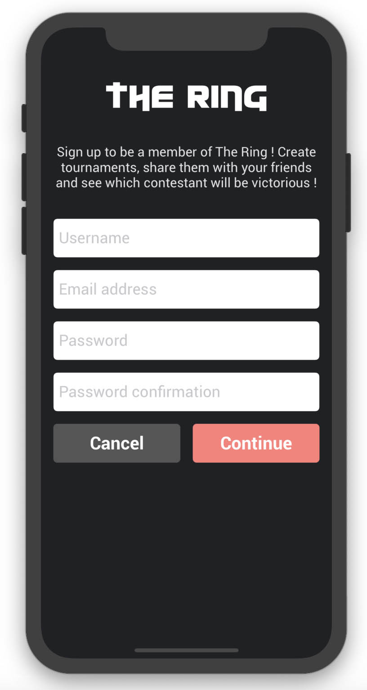

# The Ring
The Ring is a social app where you can create movie contests and vote for a winner.  
I use TMDB API for all the movie searching part, and to gather movie data.  
[If you want to hear more about it, check their website.](https://www.themoviedb.org/)

 

# Example

You wonder what is the best movie of 2019 ? Why don't you ask !
With The Ring, you can create a contest for it.

Let's say you have a few movies in your head, but don't know which is the best. You can list them and create rounds, where people will vote.

Here, 4 movies were listed. Movie 1 and 4 were the winners of the first round, and Movie 1 won the second round. It seems like we know which movie is the best !

# Basic functionalities

- [x] Create an account
- [x] Login
- [x] User profile (with possibility to update data)
- [x] Friends system
- [x] Create a tournament
- [x] Consult tournaments
- [x] Share them
- [x] Vote
- [x] Comments on tournaments
- [x] Support of french language
- [x] Tournament search by titles
- [x] Home feed with user tournaments

# Login & Signup

 

# Home

# Profile

 
 

# Friends

  

# Tournament creation

  
 

# Tournament search & detailed view

  

# Comment tournaments

